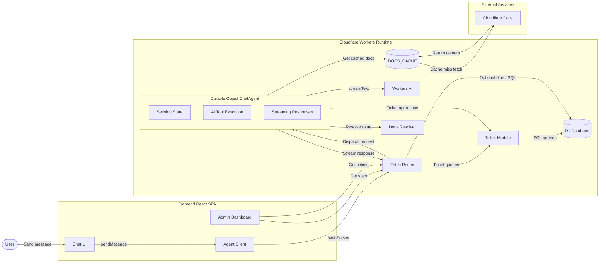

# Cloudflare Support Agent

Uses the starter template for building AI chat agents on Cloudflare, powered by the [Agents SDK](https://developers.cloudflare.com/agents/).

## Overview

This repository implements a Cloudflare AI support agent built on the Agents SDK and Workers AI. It is designed to handle customer support conversations, classify issues, create and manage tickets, fetch Cloudflare documentation, and escalate when needed.



### ChatAgent features

- Conversational customer support flow driven by `ChatAgent`
- Customer identification using email-based lookup and ticket history
- Issue classification, sentiment, urgency assessment, and ticket creation
- Tool-driven workflow for automatic ticket CRUD and knowledge retrieval
- Cloudflare doc ingestion via cached HTML cleanup for non-product docs
- Escalation logic for sensitive issues, billing disputes, security, and human handoff
- Streaming AI responses, persistent session state, and real-time UI updates

### Tool calls used by the agent

- `createTicket` — persists a new support ticket in D1
- `getTicket` — retrieves an existing ticket by ID
- `updateTicketStatus` — updates ticket status (`open`, `pending`, `closed`, etc.)
- `appendTranscript` — adds conversation text to a ticket transcript
- `findRecentTickets` — retrieves recent ticket history for a customer
- `findCustomerHistory` — fetches up to the last 20 tickets for a customer
- `identifyCustomer` — checks for existing customer records by email
- `fetchCloudflareDocs` — fetches and sanitizes Cloudflare documentation pages for answers

### Cloudflare products used

- **Cloudflare Workers** — hosts the AI chat agent backend
- **Agents SDK** — orchestrates chat, tools, and long-lived agent state
- **Workers AI** — powers conversational AI and knowledge retrieval
- **D1** — stores tickets
- **Durable Objects** — persists chat session state and message history
- **KV** — caches fetched documentation pages for efficiency

### Local setup for another user

1. Clone the repository:

```bash
git clone https://github.com/Rithish288/cf_ai_Cloudflare_Support_Agent.git
cd cf_ai_Cloudflare_Support_Agent
```

2. Install dependencies:

Make sure you have the latest version of node and wrangler installed

```bash
npm install
```

3. Wrangler setup
```
npx wrangler login
npx wrangler dev
```

4. Start the development server:

```bash
npm run dev
```

5. Open the app in your browser:

```text
http://localhost:5173
```

6. Use the chat UI to ask support-related questions and observe ticket creation, knowledge fetch, and escalation behavior.

Try prompts like:

- `My CDN is returning 522 errors. Can you help?`
- `I need to update my contact email and check ticket status.`
- `What is Cloudflare's page rules policy?`

## Project structure

```
src/
  server.ts    # Chat agent with tools
  app.tsx      # Main UI built with Kumo components
  chat.tsx     # Chat UI using useAgent
  admin.tsx.   # Dashboard showing tickets raised
  client.tsx   # React entry point
  styles.css   # Tailwind + Kumo styles
  
```

## What's included

- **AI Chat** — Streaming responses powered by Workers AI via `AIChatAgent`
- **Image input** — Drag-and-drop, paste, or click to attach images for vision-capable models
- **Kumo UI** — Cloudflare's design system with dark/light mode
- **Real-time** — WebSocket connection with automatic reconnection and message persistence

## License

MIT
